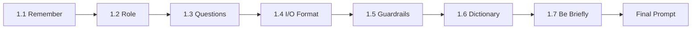
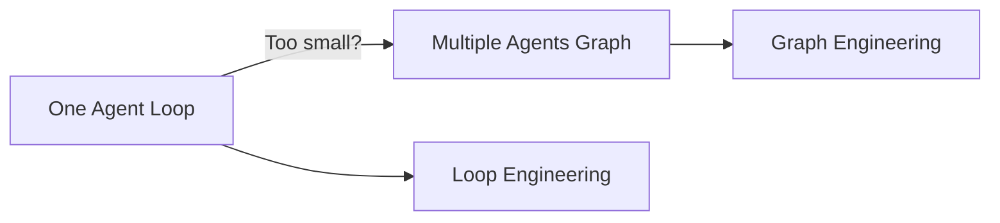
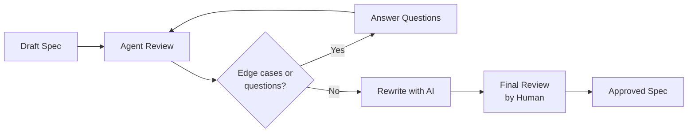

# AI TRICKS 101

In this file, I describe AI tricks and some useful concepts. If you think something is missing, please send a PR and complete this file.

---

## 1. PROMPT

A prompt is the shared language between a user and an AI model. Each agent can enhance the input prompt to get better results. Therefore, the more precisely we describe what we need, the better the results.

### 1.1 REMEMBER

```
"AI models are stupid workers that don't know what you want, so tell them exactly what their job is."
In other words: "You can drink wine from a bowl or a glass. With both, you're drinking water. BUT AT WHAT COST?"
```

### 1.2 ROLE

I give a role to my model whenever I want to write a spec (described below), implement a feature, or tackle a big job. This trick helps the AI model understand how it SHOULD think and reason.

#### Example

```
You are a senior software engineer.

I want to write a spec file to implement something...
```

### 1.3 AI QUESTIONS

You should learn that humans have questions when you explain your idea — so AI models can have them too. My trick is to add this line at the END of ANY prompt:

```
You are a senior software engineer.

I want to write a spec file to implement something...

If you have any questions, ask them before starting.
```

It helps the AI model stay on the same page.

**This trick is the most important one!**

### 1.4 I/O FORMAT

One of the most commonly missing pieces of information in spec files, skills, etc. is the I/O format. This tells the AI agent what to expect as input (a prompt, a file, etc.) and how to generate the output.

#### Example

```
You are a senior software engineer.

I want to write a spec file to implement something...

The input format should be one **spec file in md format** with this template:

"""
# {FEATURE_TITLE}
[description about the feature]

## GOALS
[list of the goals]
"""

You should write the **spec file in md format** as output in this format:

"""
# {FEATURE NAME}
[description about the feature]

## BUSINESS LOGIC
[describe business logic step by step]
"""

If you have any questions, ask them before starting.
```

### 1.5 GUARDRAILS

Guardrails are prohibited rules. If you want to limit the AI model from doing something, this section is for it.

#### Example

```
You are a senior software engineer.

I want to write a spec file to implement something...

The input format should be one **spec file in md format** with this template:

"""
# {FEATURE_TITLE}
[description about the feature]

## GOALS
[list of the goals]
"""

You should write the **spec file in md format** as output in this format:

"""
# {FEATURE NAME}
[description about the feature]

## BUSINESS LOGIC
[describe business logic step by step]
"""

GUARDRAILS:
- never delete anything without user permission
- you should follow the I/O format and do not add extra sections

If you have any questions, ask them before starting.
```

### 1.6 DICTIONARY

Some words have multiple or fancy meanings. You should describe those words so the AI agent figures out the exact meaning you intend.

#### Example

```
Find the magic in the code.

magic: the complex parts with bad practice in each section of code are called magic.
```

### 1.7 BE BRIEFLY
Add this at the **end** of your prompt when you want short answers and less token burn:

Same idea as the [caveman](https://github.com/JuliusBrussee/caveman) skill — caveman mouth small, brain still big — but you don't need a skill: one line at the end often does the job at least partially if installing that skill is not desirable.



---

## 2. PHILOSOPHY

### 2.1 [GRAPH ENGINEERING VS LOOP ENGINEERING](https://www.aibuilderclub.com/blog/graph-engineering-vs-loop-engineering)

Loop engineering is designing the loop a single agent runs: discover, plan, execute, verify, repeat until a stop condition. You stop hand-writing prompts and start designing the cycle and its exit test. (That's the whole discipline — our Loop Engineering guide covers why the verifier, not the model, is the bottleneck.)

Graph engineering is what you do when one loop isn't enough: you wire multiple specialized agents or steps into a graph.

Read the article at the title link.

### 2.2 [SDD (SPEC DRIVEN DEVELOPMENT)](https://martinfowler.com/articles/exploring-gen-ai/sdd-3-tools.html)

The spec becomes the source of truth for both the human and the AI.

Read the article at the title link.



---

## 3. MY TOP SKILLS

### 3.1 [graphify](https://github.com/Graphify-Labs/graphify)

Type `/graphify` in your AI coding assistant and it maps your entire project into a knowledge graph you can query instead of grepping through files. It helps you traverse code easily and find targets exactly. When implementing a feature, it can increase your accuracy and help you reach better results.

### 3.2 [skill-creator](https://github.com/anthropics/skills/tree/main/skills/skill-creator)

If you say you create a skill without this skill, doubt yourself. You may need to **review** and change something after generating a skill via this skill.

### 3.3 [caveman](https://github.com/JuliusBrussee/caveman)

Make your AI coding agent talk like a caveman. Same answers, 65% fewer output tokens on prose, 8.5% on long-horizon agentic coding runs. Brain still big. Mouth small.

### 3.4 [feature-manager](https://github.com/blkst8/skills/tree/master/skills/feature-manager)

This skill was written by me and it looks like [goalbuddy](https://github.com/tolibear/goalbuddy). Both skills generate an md file that defines goals and tasks based on your feature. After defining the path for implementation, they can start implementing through those goals.

---

## 4. SKILLS & SPEC

In this section I describe how to write skills and specs.

### 4.1 FRONT-MATTER

Frontmatter is a **metadata block** at the very top of a Markdown file, wrapped in `---` delimiters. Frontmatter is used in skills, but you can also use it in your generated md files (e.g., docs).

#### Example

I create a doc for a project and I add frontmatter in this template:

```
---
branch: main
commit-hash: 8jsid82
generated-by: blkst8
date: 2026-08-01
---
```

### 4.2 EVALS

"Evals skills" usually refers to evaluating AI skills — testing how well an AI model or agent performs specific tasks.

Evals is short for evaluations. In AI, evals are structured tests used to measure abilities such as:

- Reasoning
- Coding
- Math
- Writing quality
- Instruction following
- Tool use
- Safety
- Factual accuracy
- Multilingual ability
- Domain knowledge

AI evals help developers understand:

- What the AI is good at
- Where it fails
- Whether a new model is better than an old one
- Whether the AI follows instructions correctly
- Whether it is safe and reliable

### 4.3 WRITE SPEC

For most tasks I use a spec file. The spec file is the source of truth for your AI. Therefore, it's the most important file in your workflow.

I usually write my specs something like this:

```
# {title of my feature}
[describe what I want in this spec file]

## DICTIONARY
[for more information read 1.6]

## TECH/BUSINESS LOGIC
[describe what I need in text and bullet points]

## Measurement Criteria
[describe what criteria are important to you. e.g. maintainability, test coverage, extensibility, etc]

## ALGORITHM
[if you need to run an algorithm, tell the agent step by step.]

## Rules
[list all rules that AI models should observe]

## ❌ Wrong Behavior (Do NOT do this)
[say with **examples** what exactly is wrong in the implementation. This section helps the model prevent over-engineering. This is different from guardrails.]

## 📊 Expected Behavior
[say with **examples** what exactly you need.]

## GUARDRAILS
[for more information read 1.5]
```

You can add or remove sections.

After writing your spec, give it to the agent to review, find edge cases, and ask questions (read 1.3). After that, you can tell your AI model to rewrite it. The new version of your spec file will be more complete and AI-compatible.



**DO NOT FORGET TO REVIEW THE LAST VERSION OF THE SPEC WRITTEN BY AI!!!**

### 4.4 WRITE SKILL

---

## AGENTS

## MEMORY

## FACTS

---

## MCP

## CDP (Chrome DevTools Protocol)

## DESIGN
